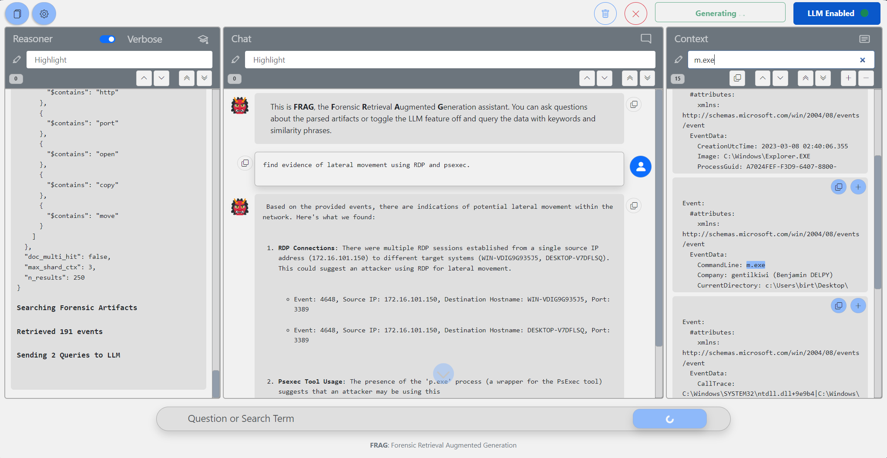
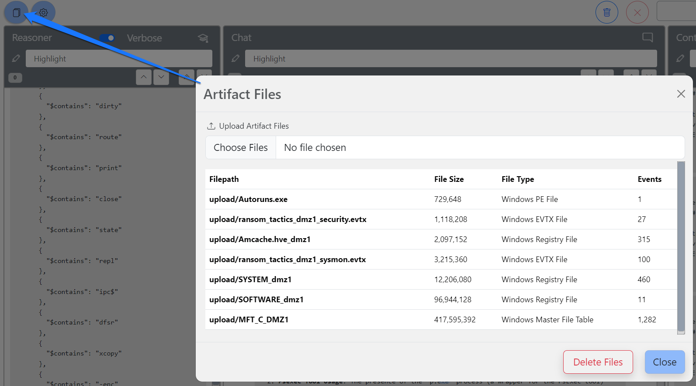
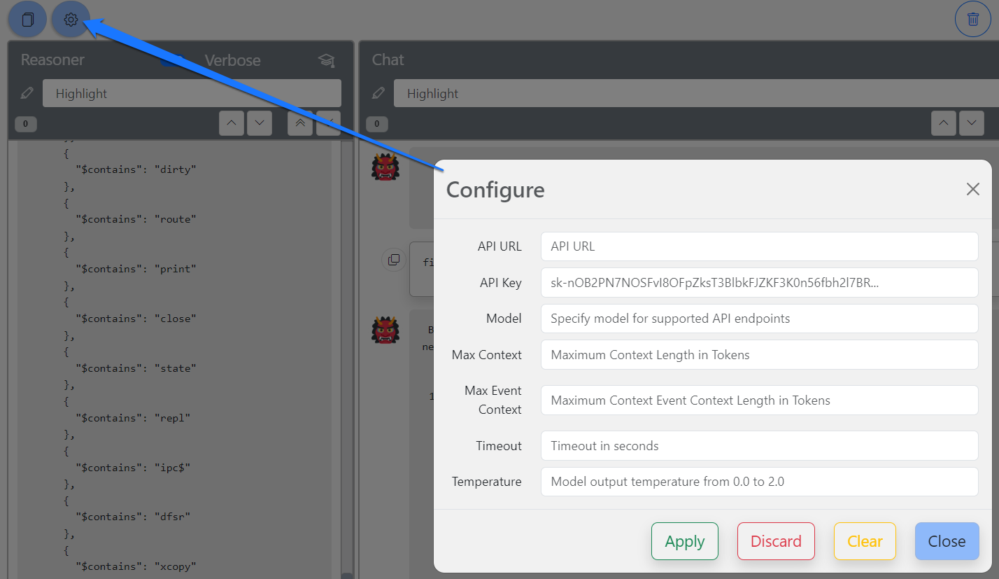

# F.R.A.G.
### Forensic Retrieval Augmented Generation



This is a **toy** application, it's not meant to be anywhere close to production ready.  With it, I wanted to explore:
- Creating a RAG system w/o LangChain
- See if a RAG on forensic data was even feasible
- Tinker with vector/similarity databases

With FRAG, you can upload Windows forensic artifacts such as:
- $MFT Master File Table
- Windows EVTX event log files
- PDF Files
- Windows PE Files
- Windows Registry Hives

After the data has been processed, you can query the agent and it will attempt to answer your query through a sequence of logical steps:
- Look for time ranges
- Expand the original query for the similarity search
- Generate IOC strings for similarity search filters
- Find similar events and present them with the original user query

Feedback is welcome!

### Installation Instructions

#### Clone
```console
git clone https://github.com/eheuser/FRAG.git
```

#### Install Python (3.11 tested) Requirements
```console
pip install -r requirements.txt
```

To install CUDA accelerated Torch, follow the instructions [here](https://pytorch.org/get-started/locally/)
```console
pip3 install torch torchvision torchaudio --index-url https://download.pytorch.org/whl/cu118
```

#### Start Application
```console
python3.11 .\frag_app.py
```

#### Add Files


#### Configure LLM
